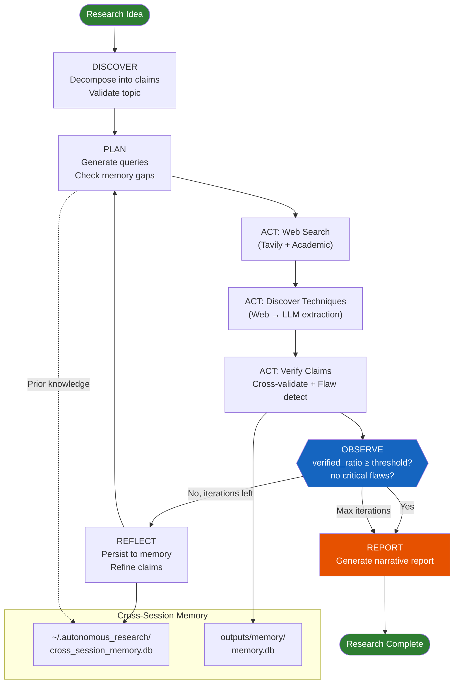
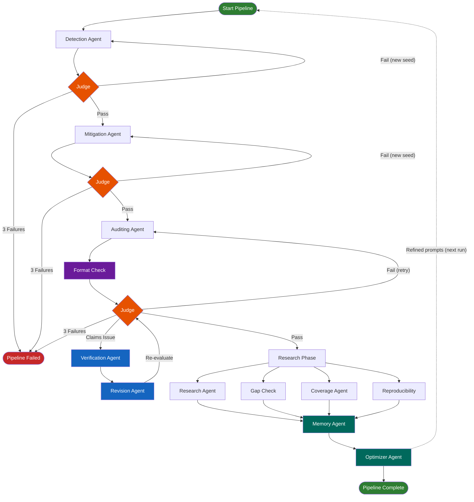

# Autonomous Research System

A generalized, multi-agent research platform that takes **any research idea** as input and produces a comprehensive research report. The system autonomously discovers relevant techniques through web research, cross-validates claims against academic literature, detects flaws, and iterates until convergence.

Also includes a legacy **Bias Audit Pipeline** mode for credit-card fraud detection fairness research.

---

## Table of Contents

- [Overview](#overview)
- [Generalized Research Mode](#generalized-research-mode)
- [Bias Audit Pipeline (Legacy)](#bias-audit-pipeline-legacy)
- [Architecture](#architecture)
- [Project Structure](#project-structure)
- [Components](#components)
- [Configuration](#configuration)
- [Setup & Run](#setup--run)
- [Environment Variables](#environment-variables)
- [Outputs](#outputs)
- [Testing](#testing)
- [Extension Points](#extension-points)
- [Troubleshooting](#troubleshooting)

---

## Overview

The system operates in three modes:

| Mode | Command | Description |
|------|---------|-------------|
| **Generalized Research** (default) | `python main.py "Your research idea"` | Accepts any topic; discovers techniques via web; produces report |
| **Claims Research Loop** | `python main.py --research --claims claims.json` | Iterative verification of user-supplied claims |
| **Bias Audit Pipeline** | `python main.py --pipeline` | Legacy bias detection/mitigation/auditing paper generation |

### Key Capabilities

- **Domain-agnostic**: Input any research idea — the system discovers techniques, methods, and relevant literature automatically
- **Multi-LLM support**: Swap between Google Gemini, OpenAI, Anthropic, or Ollama via config
- **Real-time web search**: Tavily integration for current literature and technique discovery
- **Cross-session memory**: Persistent knowledge base that improves across runs
- **LangGraph orchestration**: State-machine pipeline with conditional edges and checkpointing
- **Sandboxed code execution**: Static analysis + runtime restrictions block dangerous imports
- **Distributed tracing**: LangSmith + OpenTelemetry integration for debugging and profiling
- **MCP integration**: Model Context Protocol for plugging in external tool servers
- **React GUI**: Modern TypeScript frontend with WebSocket streaming
- **Telegram bot**: Research via chat
- **Docker deployment**: Containerized with Docker Compose

---

## Generalized Research Mode

The default mode accepts any research idea and produces a comprehensive report:

```bash
# Interactive prompt
python main.py

# Direct input
python main.py "Effect of transformer architecture on protein folding prediction"

# With options
python main.py "Quantum error correction techniques" --iterations 8 --threshold 0.9
```

The system follows a **DISCOVER → PLAN → ACT → OBSERVE → REFLECT** cycle powered by [LangGraph](https://github.com/langchain-ai/langgraph):

| Phase | What Happens |
|-------|-------------|
| **DISCOVER** | Decompose idea into testable claims; identify domain; validate research topic |
| **PLAN** | Generate search queries from claims + cross-session memory gaps |
| **ACT** | Web search (Tavily) → technique discovery → claim verification → cross-validation → flaw detection |
| **OBSERVE** | Compute `verified_ratio`; check for blocking flaws; evaluate convergence |
| **REFLECT** | Persist findings to cross-session memory; refine claims for next iteration |
| **REPORT** | Generate comprehensive narrative report with executive summary, findings, and recommendations |

**Convergence** is declared when `verified_ratio ≥ converge_threshold` (default `0.85`) **and** no critical flaws remain, or when `max_iterations` is reached.

**Technique Discovery**: Instead of hardcoding methods (e.g., SMOTE, ThresholdOptimizer), the system discovers relevant techniques through real-time web search and academic literature retrieval, then stores them in cross-session memory for future runs.

### Claims Research Loop

For iterative verification of specific claims:

```bash
python main.py --research --claims claims.json --goal "My research goal" --iterations 8
python main.py --research   # uses outputs/idea_input.json as default claims source
```

---

## Bias Audit Pipeline (Legacy)

The original bias audit mode remains available for credit-card fraud detection research:

```bash
python main.py --pipeline
```

This runs the sequential agent pipeline: **Detection → Judge → Mitigation → Judge → Auditing → Judge → Research Phase**, producing an IEEE/CUCAI-format LaTeX paper. See the [legacy workflow details](#legacy-pipeline-details) section for full documentation.

---

## Architecture

### Generalized Research Pipeline (LangGraph)



### Bias Audit Pipeline (Legacy)



---

## Project Structure

```
Autonomous-Research-System/
├── main.py                   # CLI entry point (3 modes: research, --research, --pipeline)
├── run_gui.py                # GUI entry point (web dashboard)
│
├── agents/                   # All agent modules
│   ├── detection_agent.py          # Bias detection (legacy pipeline)
│   ├── mitigation_agent.py         # Bias mitigation (legacy pipeline)
│   ├── auditing_agent.py           # Paper generation (legacy pipeline)
│   ├── judge_agent.py              # Quality evaluation (rule-based + LLM)
│   ├── revision_agent.py           # Applies Judge feedback to paper
│   ├── verification_agent.py       # Code-based claim verification
│   ├── research_agent.py           # alphaXiv/arXiv research for claims
│   ├── cross_validation_agent.py   # Cross-validate claims vs retrieved papers
│   ├── flaw_detection_agent.py     # Detect logical/statistical/methodological flaws
│   ├── self_check_agent.py         # Autonomy diagnostics
│   ├── idea_input_agent.py         # Parse uploaded research ideas (multimodal)
│   ├── gap_check_agent.py          # Paper vs reference PDF coverage
│   ├── coverage_agent.py           # Finds papers for gaps
│   ├── topic_coverage_agent.py     # Verifies topic comprehensiveness
│   ├── reproducibility_agent.py    # Reproducibility validation
│   ├── claim_comparison_agent.py   # Compares literature vs our claims
│   ├── format_check_agent.py       # Validates output tables/JSON/LaTeX format
│   ├── optimizer_agent.py          # Prompt refinement from memory
│   └── memory_agent.py             # SQLite-backed self-learning persistence
│
├── orchestration/            # Pipeline orchestration
│   ├── langgraph_orchestrator.py         # ★ LangGraph research pipeline (generalized)
│   ├── orchestrator.py                   # Legacy pipeline + Judge loop + retries
│   ├── continuous_research_loop.py       # Claims-based iterative research loop
│   ├── research_orchestrator.py          # Coordinates research phases
│   ├── continuous_runner.py              # Background process manager
│   ├── idea_verification_orchestrator.py # Idea submission workflow
│   └── sep_layer.py                      # Self-evolution protocol (SEPL)
│
├── runtime/                  # Unified execution engine
│   └── core.py               # PipelineRuntime, RuntimeConfig, RuntimeSummary
│
├── utils/                    # Shared utilities
│   ├── multi_llm_client.py         # ★ LangChain multi-provider LLM client
│   ├── web_search_client.py        # ★ Tavily web search + academic retrieval
│   ├── cross_session_memory.py     # ★ Long-term cross-session persistent memory
│   ├── sandbox.py                  # ★ Sandboxed code execution (static + runtime)
│   ├── tracing.py                  # ★ LangSmith + OpenTelemetry distributed tracing
│   ├── mcp_integration.py          # ★ Model Context Protocol registry + client
│   ├── telegram_bot.py             # ★ Telegram bot wrapper
│   ├── context.py                  # PipelineContext + ResearchContext (in-process state)
│   ├── schemas.py                  # Dataclass I/O contracts
│   ├── llm_client.py               # Legacy Gemini API wrapper
│   ├── events.py                   # EventBus for pub/sub agent communication
│   ├── config_loader.py            # Lazy/progressive config loading (thread-safe)
│   ├── claims_loader.py            # Parse claims from JSON, text, or idea_input.json
│   ├── research_client.py          # alphaXiv/arXiv/Semantic Scholar integration
│   ├── latex_generator.py          # LaTeX paper (IEEE/CUCAI 2026 format)
│   ├── structure_review.py         # Structure review, citation research
│   └── ...                         # Other utilities
│
├── gui/                      # Web dashboard
│   ├── server.py             # FastAPI + WebSocket + CORS + /api/research
│   ├── streaming_orchestrator.py
│   ├── static/               # Legacy static UI (index.html, app.js)
│   └── frontend/             # ★ React/TypeScript GUI
│       ├── package.json
│       ├── tsconfig.json
│       ├── public/index.html
│       └── src/
│           ├── App.tsx
│           ├── index.tsx
│           ├── types.ts
│           ├── hooks/useWebSocket.ts
│           ├── components/
│           │   ├── ResearchInput.tsx
│           │   ├── ProgressLog.tsx
│           │   ├── ReportView.tsx
│           │   └── StatusBar.tsx
│           └── styles/App.css
│
├── configs/                  # Declarative configuration
│   ├── pipeline.yaml         # All settings (LLM, search, sandbox, tracing, MCP, etc.)
│   ├── prompts/              # LLM prompt templates (lazy-loaded)
│   └── rules/                # Consistency rules (JSON)
│
├── tests/                    # Test suite (249 tests)
│   ├── test_phase1_foundation.py      # Multi-LLM, web search, memory, config (32)
│   ├── test_phase2_architecture.py    # Sandbox, tracing, LangGraph (29)
│   ├── test_phase3_integration.py     # MCP, Telegram, Docker (27)
│   ├── test_phase5_comprehensive.py   # Golden datasets, edge cases (25)
│   ├── test_edge_cases_exhaustive.py  # Adversarial, concurrent, SQL injection (102)
│   ├── test_autonomy_self_check.py    # Self-check diagnostics
│   ├── runtime/                       # Runtime contract tests
│   ├── gui/                           # GUI tests
│   └── integration/                   # End-to-end integration tests
│
├── docker-compose.yml        # FastAPI server + LaTeX sidecar
├── Dockerfile
├── requirements.txt
├── .env.example              # All environment variables documented
├── README.md
├── SETUP.md
└── kaggle.json.example
```

★ = New in v2.0

---

## Components

### LangGraph Research Orchestrator (`orchestration/langgraph_orchestrator.py`) ★

- **Role:** Domain-agnostic research pipeline using LangGraph StateGraph.
- **State:** `ResearchState` TypedDict flows through all nodes (in-process, no filesystem coupling).
- **Nodes:** `discover_node` → `plan_node` → `act_research_node` → `act_discover_techniques_node` → `act_verify_node` → `observe_node` → `reflect_node` → `generate_report_node`
- **Conditional edges:** `_should_continue` routes to either `plan` (iterate) or `generate_report` (converged/max iterations).
- **API:** `run_research(idea, goal=, max_iterations=, converge_threshold=) → dict`
- **CLI:** `python -m orchestration.langgraph_orchestrator "Your research idea"`

### Multi-LLM Client (`utils/multi_llm_client.py`) ★

- **Role:** LangChain-based abstraction supporting any LLM provider. Provider swapping is a config change.
- **Interface:** `BaseLLMClient` with `generate()`, `generate_json()`, `is_available()`, `provider_name`
- **Providers:** Google Gemini, OpenAI, Anthropic, Ollama (local)
- **Fallback:** Automatic fallback to secondary provider on rate limits
- **Factory:** `get_llm_client()` singleton, `reset_client()` for testing
- **Legacy:** `LegacyGeminiClient` wraps original `utils/llm_client.py` for backward compatibility

### Web Search Client (`utils/web_search_client.py`) ★

- **Role:** Unified web + academic search via Tavily API.
- **API:** `research_search(query, include_academic=True, include_web=True) → tuple[str, list[dict]]`
- **Academic sources:** arXiv, Semantic Scholar (built-in, no API key needed)
- **Config:** `TAVILY_API_KEY` env var or `configs/pipeline.yaml → search`

### Cross-Session Memory (`utils/cross_session_memory.py`) ★

- **Role:** Long-term persistent memory at `~/.autonomous_research/cross_session_memory.db`.
- **Tables:** `user_profiles`, `domain_expertise`, `research_history`, `persistent_knowledge`, `technique_registry`, `learned_patterns`
- **Key APIs:** `store_knowledge()`, `get_knowledge()`, `register_technique()`, `get_techniques()`, `learn_pattern()`, `get_patterns()`, `log_session()`, `cross_session_summary()`
- **Technique discovery:** Stores techniques discovered via web research, reusable across sessions.

### Sandbox (`utils/sandbox.py`) ★

- **Role:** Sandboxed code execution for claim verification.
- **Static analysis:** Blocks `os`, `subprocess`, `shutil`, `ctypes`, `socket` imports; catches `exec()`/`eval()` patterns via regex.
- **Runtime:** Timeout enforcement, memory limits (ulimit on Unix), `PYTHONIOENCODING=utf-8`.
- **Docker option:** `SandboxConfig(use_docker=True)` for full container isolation.
- **API:** `execute_code(code, config=) → SandboxResult`

### Distributed Tracing (`utils/tracing.py`) ★

- **Role:** LangSmith + OpenTelemetry integration for debugging and profiling.
- **Decorators:** `@trace_llm_call` (wraps LLM calls), `@trace_agent("name")` (wraps agent functions)
- **Context manager:** `with trace_phase("phase_name"):` for pipeline phases
- **Config:** `LANGCHAIN_TRACING_V2=true`, `LANGCHAIN_API_KEY` for LangSmith

### MCP Integration (`utils/mcp_integration.py`) ★

- **Role:** Model Context Protocol registry for connecting external tool servers.
- **Transports:** stdio, HTTP/SSE
- **API:** `MCPRegistry.from_config()`, `connect_all()`, `call_tool()`, `to_tool_descriptions()`
- **Config:** `configs/pipeline.yaml → mcp.servers`

### Telegram Bot (`utils/telegram_bot.py`) ★

- **Role:** Thin wrapper over the LangGraph orchestrator for Telegram access.
- **Commands:** `/start`, `/research <idea>`, `/status`, `/help`
- **Config:** `TELEGRAM_BOT_TOKEN` env var

### Research Context (`utils/context.py`) ★

- **Role:** In-process state objects replacing filesystem coupling.
- **Classes:** `ResearchContext` (generalized), `PipelineContext` (legacy bias pipeline)
- **Typed objects:** `Claim`, `Technique`, `Flaw` dataclasses with `compute_metrics()`, `to_dict()`, `from_dict()`
- **Serialization:** Optional `save()` to JSON for checkpointing

### Config Loader (`utils/config_loader.py`)

- **Role:** Lazy/progressive loading of pipeline config and prompt templates.
- **Thread-safe:** Uses locking for concurrent access.
- **API:** `load_pipeline_config()` (cached), `load_prompt(name)` (lazy), `invalidate_cache()`

### Runtime (`runtime/core.py`)

- **Role:** Unified execution engine for the legacy pipeline.
- **Key classes:** `RuntimeConfig`, `PipelineRuntime`, `RuntimeSummary`

### Legacy Orchestrator (`orchestration/orchestrator.py`)

- **Role:** Controller for the bias audit pipeline. Runs agents in order, calls Judge, handles retries.
- **Constants:** `MAX_RETRIES = 3`, core agents: detection → mitigation → auditing

### Memory Agent (`agents/memory_agent.py`)

- **Role:** Session-scoped SQLite memory at `outputs/memory/memory.db`.
- **Tables:** `runs`, `agent_runs`, `metrics`, `verifications`, `research_goals`, `knowledge_entries`, `pitfalls`, `effective_methods`
- **Key APIs:** `persist_run()`, `add_knowledge()`, `add_pitfall()`, `research_journey_summary()`

### LLM Client (`utils/llm_client.py`)

- **Role:** Legacy Gemini API wrapper. Still used by original agents.
- **Superseded by:** `utils/multi_llm_client.py` for new code.

---

## Configuration

All configuration lives in `configs/pipeline.yaml`. Key sections:

### LLM Configuration (`configs/pipeline.yaml → llm`)

| Key | Default | Purpose |
|-----|---------|---------|
| `provider` | `google` | LLM provider (`google`, `openai`, `anthropic`, `ollama`) |
| `model` | `gemini-2.5-flash` | Model name |
| `fallback_provider` | `openai` | Fallback on rate limits |
| `fallback_model` | `gpt-4o-mini` | Fallback model |
| `temperature` | `0.2` | Generation temperature |
| `max_output_tokens` | `8192` | Max tokens per response |

### Search Configuration (`configs/pipeline.yaml → search`)

| Key | Default | Purpose |
|-----|---------|---------|
| `tavily_enabled` | `true` | Enable Tavily web search |
| `include_academic` | `true` | Include arXiv/Semantic Scholar |
| `max_results` | `5` | Results per query |

### Sandbox Configuration (`configs/pipeline.yaml → sandbox`)

| Key | Default | Purpose |
|-----|---------|---------|
| `timeout_seconds` | `30` | Code execution timeout |
| `max_memory_mb` | `512` | Memory limit |
| `use_docker` | `false` | Use Docker container isolation |
| `blocked_imports` | `[os, subprocess, ...]` | Blocked Python modules |

### Tracing Configuration (`configs/pipeline.yaml → tracing`)

| Key | Default | Purpose |
|-----|---------|---------|
| `langsmith_enabled` | `false` | Enable LangSmith tracing |
| `opentelemetry_enabled` | `false` | Enable OpenTelemetry |
| `project_name` | `autonomous-research` | LangSmith project name |

### MCP Configuration (`configs/pipeline.yaml → mcp`)

| Key | Default | Purpose |
|-----|---------|---------|
| `servers` | `[]` | List of MCP server connections |

### Research Loop Configuration (`configs/pipeline.yaml → research_loop`)

| Key | Default | Purpose |
|-----|---------|---------|
| `max_iterations` | `10` | Max loop iterations |
| `converge_threshold` | `0.90` | Required verified claim fraction |
| `flaw_halt_severity` | `critical` | Severity blocking convergence |

---

## Environment Variables

All variables are documented in `.env.example`:

| Variable | Required | Purpose |
|----------|----------|---------|
| `GOOGLE_API_KEY` | For Google LLM | Google Gemini API key |
| `OPENAI_API_KEY` | For OpenAI LLM | OpenAI API key |
| `ANTHROPIC_API_KEY` | For Anthropic LLM | Anthropic API key |
| `LLM_PROVIDER` | No | Override provider (google/openai/anthropic/ollama) |
| `GEMINI_MODEL` | No | Override Gemini model name |
| `TAVILY_API_KEY` | For web search | Tavily search API key |
| `LANGCHAIN_TRACING_V2` | No | Enable LangSmith (`true`) |
| `LANGCHAIN_API_KEY` | For LangSmith | LangSmith API key |
| `TELEGRAM_BOT_TOKEN` | For Telegram | Telegram bot token |
| `ALPHAXIV_TOKEN` | For alphaXiv | alphaXiv API token |

---

## Setup & Run

### Quick Start

```bash
# Create and activate venv
python -m venv .venv
.venv\Scripts\Activate.ps1   # Windows PowerShell
# source .venv/bin/activate  # Linux/macOS

# Install dependencies
pip install -r requirements.txt

# Copy and configure environment
cp .env.example .env
# Edit .env with your API keys

# Run generalized research (default mode)
python main.py "Effect of attention mechanisms on image classification"

# Or interactive mode
python main.py
```

### Running Modes

```bash
# Generalized research (default)
python main.py "Your research idea here"
python main.py "Your idea" --iterations 8 --threshold 0.9

# Claims-based research loop
python main.py --research --claims claims.json --goal "My goal"

# Legacy bias audit pipeline
python main.py --pipeline
```

### Running with GUI

```bash
# Legacy static GUI
python run_gui.py
# Open http://127.0.0.1:8000

# React GUI (development)
cd gui/frontend && npm install && npm start
# Open http://localhost:3000 (proxies API calls to :8000)
```

### Docker Deployment

```bash
# Start the research API server
docker-compose up research-api

# With LaTeX sidecar (for PDF generation)
docker-compose --profile latex up
```

### Telegram Bot

```bash
# Set token in .env
TELEGRAM_BOT_TOKEN=your_token_here

# Start
python -m utils.telegram_bot
```

### Individual Agents (Legacy)

```bash
python -m agents.detection_agent [seed]
python -m agents.mitigation_agent [seed]
python -m agents.auditing_agent
python -m agents.judge_agent [detection|mitigation|auditing]
```

### Optional Setup

- **Kaggle:** For legacy pipeline dataset download. See [SETUP.md](SETUP.md).
- **LaTeX:** For PDF compilation. See [SETUP.md](SETUP.md).
- **Tavily:** For web search. Get API key at [tavily.com](https://tavily.com).
- **LangSmith:** For distributed tracing. See [smith.langchain.com](https://smith.langchain.com).

---

## Outputs

### Generalized Research Mode

| Path | Description |
|------|-------------|
| `outputs/research_report.json` | Comprehensive research report (JSON) |
| `outputs/research_context.json` | Serialized ResearchContext (optional checkpoint) |
| `outputs/memory/memory.db` | Session-scoped SQLite knowledge base |
| `~/.autonomous_research/cross_session_memory.db` | Long-term cross-session memory |

### Legacy Pipeline Mode

| Path | Description |
|------|-------------|
| `outputs/paper/paper.tex` | LaTeX source |
| `outputs/paper/paper.pdf` | Compiled PDF (if pdflatex installed) |
| `outputs/paper_sections/*.md` | Individual sections |
| `outputs/figures/*.pdf` | Publication-ready figures |
| `outputs/baseline_results.json` | Detection metrics |
| `outputs/mitigation_results.json` | Mitigation metrics + asymmetric cost |
| `outputs/cross_validation_report.json` | Per-claim literature verdict |
| `outputs/flaw_report.json` | Detected flaws with severity |
| `outputs/research_loop_report.json` | Research loop summary |
| `outputs/structure_review.json` | Structure review + citation research |

---

## Testing

The project has **249 tests** organized by feature:

```bash
# Run all tests
pytest

# Run specific test files
pytest tests/test_phase1_foundation.py      # Multi-LLM, web search, memory (32)
pytest tests/test_phase2_architecture.py     # Sandbox, tracing, LangGraph (29)
pytest tests/test_phase3_integration.py      # MCP, Telegram, Docker (27)
pytest tests/test_phase5_comprehensive.py    # Golden datasets, integration (25)
pytest tests/test_edge_cases_exhaustive.py   # Adversarial, concurrent (102)
pytest tests/test_autonomy_self_check.py     # Self-check diagnostics

# Run a single test
pytest tests/test_edge_cases_exhaustive.py::TestSandboxAdversarial::test_import_subprocess_blocked
```

Test categories:
- **Unit tests (deterministic)**: Sandbox blocking, memory CRUD, config loading, state objects
- **Golden datasets**: Parametrized scenarios for discover/observe with known expected outcomes
- **Edge cases**: SQL injection, adversarial code, Unicode, empty inputs, control characters, concurrent writes
- **Integration tests**: End-to-end flows with mocked LLM, memory roundtrips, sandbox execution

---

## Extension Points

### Adding a New LLM Provider

1. Implement `BaseLLMClient` in `utils/multi_llm_client.py`.
2. Register in the provider factory (`_create_client()`).
3. Add config section to `configs/pipeline.yaml → llm`.

### Adding an MCP Server

Add to `configs/pipeline.yaml → mcp.servers`:
```yaml
mcp:
  servers:
    - name: my_tool
      transport: stdio
      command: ["python", "-m", "my_mcp_server"]
```

### Adding a Custom LangGraph Node

1. Define a function `my_node(state: ResearchState) -> dict` in `orchestration/langgraph_orchestrator.py`.
2. Add to the graph with `graph.add_node("my_node", my_node)`.
3. Wire edges: `graph.add_edge("plan", "my_node")`.

### Legacy Pipeline Extension

1. Create `agents/new_agent.py` with `main(seed=42)`.
2. Add to `orchestration/orchestrator.py`: `module_map`, `AGENTS`.
3. Add `evaluate_new_agent()` in `agents/judge_agent.py`.

---

## Troubleshooting

| Issue | Cause | Fix |
|-------|-------|-----|
| `No module named 'langchain_google_genai'` | Missing dependency | `pip install -r requirements.txt` |
| LLM returns `None` | Missing API key or rate limit | Check `LLM_PROVIDER` and corresponding `*_API_KEY` env var |
| Sandbox blocks valid code | Static analysis false positive | Adjust `blocked_imports` in `configs/pipeline.yaml → sandbox` |
| Tavily search returns empty | Missing API key | Set `TAVILY_API_KEY` in `.env` |
| Cross-session memory not found | First run | Normal — database created automatically at `~/.autonomous_research/` |
| Windows encoding error | UTF-8 not set | Sandbox sets `PYTHONIOENCODING=utf-8` automatically |
| Legacy pipeline: "No fairness violations" | Seed produced balanced groups | Retry with different seed (orchestrator does this) |
| PDF not generated | pdflatex not installed | Install MiKTeX/TeX Live or use Docker: `docker-compose --profile latex up` |

---

## Quick Reference

```bash
# Generalized research (default mode)
python main.py "Your research idea"
python main.py "Topic" --iterations 8 --threshold 0.9

# Claims-based research
python main.py --research --claims claims.json --goal "My goal"

# Legacy bias audit pipeline
python main.py --pipeline

# GUI
python run_gui.py                    # Static GUI at :8000
cd gui/frontend && npm start         # React GUI at :3000

# Docker
docker-compose up research-api

# Telegram
python -m utils.telegram_bot

# Tests
pytest                               # All 249 tests
pytest tests/test_phase1_foundation.py  # Specific suite
```

See [SETUP.md](SETUP.md) for detailed environment setup.
